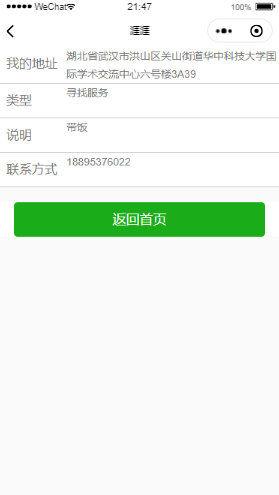
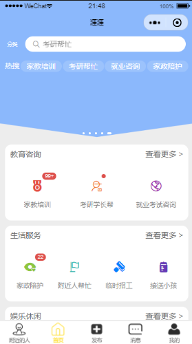
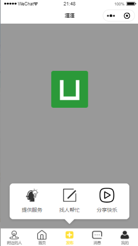
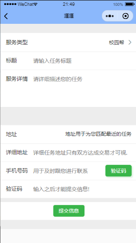
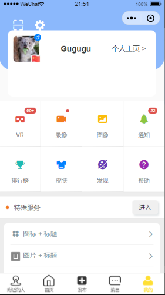

# new_yaya

## 这是一个校园社交软件

### UI页面设计部分
* 1 附近 包含两个顶部选项卡用于切换
用户初次进入页面时根据用户地点为其推荐相关的数据呈现在下面两个部分
  * 1.1  地图展现附近发布任务的地点图标
尝试在某个地方加入城市选择按钮,确定用户想要搜索的服务来自于哪里
附近 通过地图的形式显示周围有哪些用户发布了信息
  - 1.2 列表对详情进行展示
主要包括任务类型,具体细节,距离多少米,佣金多少,积分多少.
列表包含的功能:能够选择地点,附近什么距离.排序,自定义筛选功能
  - 1.3 搜索框(后期加入搜索推荐)
根据用户搜索的内容 展现在详情列表中
- 2 消息 Message,用户之间洽谈业务聊天功能
  - 包含聊天框列表
  - 群组
  - 系统提示等信息任务

- 3 发布  属于弹窗的形式供用户进行选择根据用户需求进行实时变化这里
  -  即用户进来的时候就 闻讯 然后进行特性化的展示
    - 有任务
  - 本地生活 动态  展现同一个城市人发布的动态.(消息的简写,当有人发布之后自动同步  )
  - 找任务
  - 动态 Dynamics
  - 类微博的形式
- 4 我的
  - 展示个人信息

- 授权微信登陆页面
  - 页面1 打开时 弹窗 确认获取用户信息 进行授权 点击允许获取你的个人信息
  - 页面2 授权微信登录  并绑定手机号  发送验证码 之后才能使用

- 注册页面 
    - 输入一定的个人信息 构成结构化的数据 便于后期处理
    - 姓名：对其他用户影藏 
    - 昵称：对于其他用户显示
    - 手机号：用于唯一标识用户
    - 接任务或者发布任务时判断是否进行了实名认证
    - 信息资讯类，比如教育培训，考研学长查找，等需要进行认证，实现结构化数据 方便实现数据的查询 和功能拓展
    - 学生/高校从业者：学校  学院  专业  
    - 社会人员：地址 ，公司  部门单位 下属机构。
    - 手机号

  - 3 个人信息页面  未注册 点击登录 跳转 微信授权登陆页面
    - 用于更改用户的个人信息
    - 展示一定的用户个人信息
    - 接的任务记录及评价
    - 赚取的佣金
    - 爱好  根据爱好  发起人群聚集群体
    - 发布的任务 
    - 佣金 
    - 是否被执行
    - 时间期限 9那个时间段被执行才有效 给与评价
    - 常用定位管理

- 首页要实现的功能 主要展示那些 
  - tab1 主要功能展现:分模块对APP的功能进行展现
    - 教育（中高考 大学考试 考研学长）， 家政（），工作（各类）
    - 每一项点进去之后  包含两个tab(甲方，乙方)
  - tab2 附近页面 地图展现 周围人的情况 
    - 获取当前定位 信息
    - 提取数据展示周边一定方位所有的用户 并在地图上进行标记
    - 酬金越多图标越大（添加酬金选项） 并且显示的范围也更多
    - 给每个标记上面打上一定的信息方便用户查阅
    - 待优化:图标的重叠问题 导致信息显示不全

- 任务推荐页
  - 根据大数据推荐算法为用户推荐适合他解决的需求，和能够解决他所提问题的人，以及与他拥有相同问题的人。类似的人。

- 加号 发布  页只作为一页 里面通过一个tab进行选择
  - 下面两个页面用于给用户填写具体的需求信息
  - 我是甲方
    - 地址选择 目前是只能依据定位地点来进行选择，不方便用户使用
    在手机端进行测试时是可以使用的。。在地图上加标记 获取标记处的定位，实现地址的输入
   - 关键字
   - 地址
   - 类型
   - 需求
    - 完成时间段 截止时间
    - 联系方式
  - 我是乙方
    - 包含搜索框  搜你能
    - 罗列任务列表 和酬劳待遇
    - 主动雷达式，约球活动等
    - 感知周围的人 推送邀请信息 

`2 搜索页 美团搜索差不多 可以设置距离等条件
按个人要求进行搜索`

### 界面展示图
#### 这是首页的
`通过地图图标来显示周围有哪些还没有接单的任务`

#### 这是任务的详细信息

#### 第二页
`展示所有功能供用户选择`

#### 任务发布页与接任务选择页

#### 任务发布详情页表单

#### 个人主页

